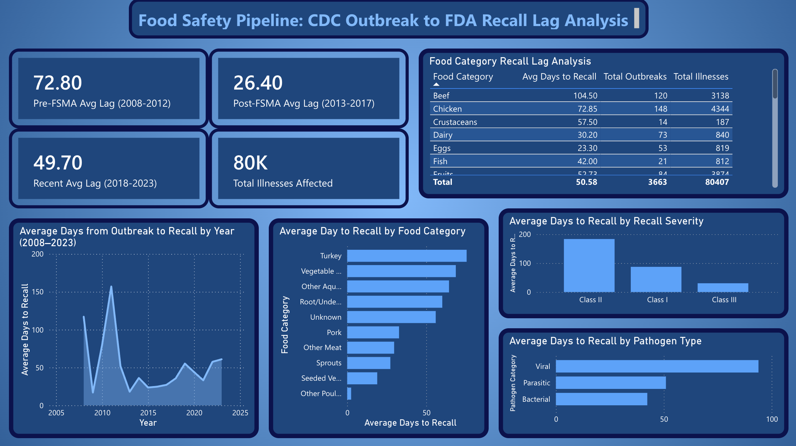

# Food Safety Pipeline: CDC Outbreak to FDA Recall Lag Analysis

A production-style ELT pipeline investigating how long it takes for the FDA to issue food recalls after the CDC identifies a foodborne illness outbreak. Built to demonstrate end-to-end data engineering using industry-standard tools.

## Research Question

**How long is the lag between a CDC-identified foodborne illness outbreak and the corresponding FDA food recall — and has this improved over time?**

## Key Findings

- **Bacterial outbreaks** are recalled 3x faster than viral outbreaks (31 days vs 89 days average)
- **FSMA legislation (2011)** dramatically improved response times — average lag dropped from 72.8 days pre-FSMA to 26.4 days post-FSMA
- **Response times have been increasing since 2018** — recent average is 49.7 days, nearly double the post-FSMA low
- **Mollusks and beef** are the slowest food categories to trigger recalls after an outbreak
- **Class I (high severity) bacterial recalls** happen fastest at 23 days average, but Class I viral recalls still take 64 days

## Dashboard

> Download the [interactive Power BI dashboard](screenshots/food_safety_dashboard.pbix) to explore the data yourself (requires Power BI Desktop).

## Architecture

FDA Enforcement API ──┐
├──► Azure Data Lake Storage Gen2 (raw)
CDC NORS Dataset ─────┘         │
▼
Snowflake (raw schema)
│
dbt transformations
├── Bronze (typed, cleaned)
├── Silver (joined, lag computed)
└── Gold (aggregated analytics)
│
Power BI Dashboard
│
Orchestrated by Apache Airflow (Docker)
## Tech Stack

| Tool | Purpose |
|------|---------|
| Python | Ingestion scripts |
| Apache Airflow | Pipeline orchestration |
| Azure Data Lake Storage Gen2 | Raw data landing zone |
| Snowflake | Cloud data warehouse |
| dbt | Data transformation (bronze/silver/gold) |
| Power BI | Dashboard and visualisation |
| Docker | Local Airflow environment |
| GitHub Actions | CI for dbt tests |

## Data Sources

- **FDA Enforcement API** — 25,100 food recall records from 2004 to present (free, no authentication required)
- **CDC NORS** — 24,729 foodborne illness outbreak records from 1971 to present (free, public download)

## Data Model

### Silver Layer — Core Matching Logic
Outbreaks are matched to recalls using pathogen name matching and a 180-day time window. Only the earliest recall per outbreak is kept to minimise false matches. This approach is probabilistic — matches represent likely relationships, not confirmed causal links.

### Gold Layer
- `mart_lag_by_pathogen` — average lag by pathogen type and category
- `mart_lag_by_year` — year-over-year trend with YoY change
- `mart_lag_by_food_category` — lag by IFSAC food category
- `mart_recall_severity` — lag comparison by FDA recall classification

## Project Structure

food-safety-pipeline/
├── ingestion/
│   ├── fda_recalls.py        # FDA API ingestion
│   └── cdc_outbreaks.py      # CDC NORS ingestion
├── loaders/
│   └── snowflake_loader.py   # ADLS2 → Snowflake loader
├── dbt/food_safety/
│   ├── models/
│   │   ├── bronze/           # Typed, cleaned source models
│   │   ├── silver/           # Joined outbreak-recall model
│   │   └── gold/             # Analytical aggregations
│   └── seeds/
│       └── pathogen_mapping.csv
├── airflow/dags/
│   └── food_safety_pipeline.py
├── screenshots/
│   ├── dashboard.png
│   └── food_safety_dashboard.pbix
└── docker-compose.yaml

## How to Run

1. Clone the repo
2. Create a `.env` file with your Azure and Snowflake credentials (see `.env.example`)
3. Install dependencies: `pip install -r requirements.txt`
4. Start Airflow: `docker compose up`
5. Trigger the DAG from `http://localhost:8080`
6. Run dbt: `cd dbt/food_safety && dbt run`

## Data Quality

dbt tests run on every model including `not_null`, `unique`, and `accepted_values` checks. 9 tests pass across the bronze layer ensuring data integrity before transformation.

## Methodology Note

Outbreak-recall matching is probabilistic. A CDC outbreak is matched to an FDA recall when they share the same pathogen and the recall occurs within 180 days of the outbreak. Only the earliest recall per outbreak is retained. This approach may undercount or overcount matches in edge cases — findings should be interpreted as statistical patterns rather than confirmed causal links.

## Author

Jasleen Dhaliwal — University of Toronto
[GitHub](https://github.com/djasleen15) | [LinkedIn](https://www.linkedin.com/in/jasleen-dhaliwal-3b57692ba/)

